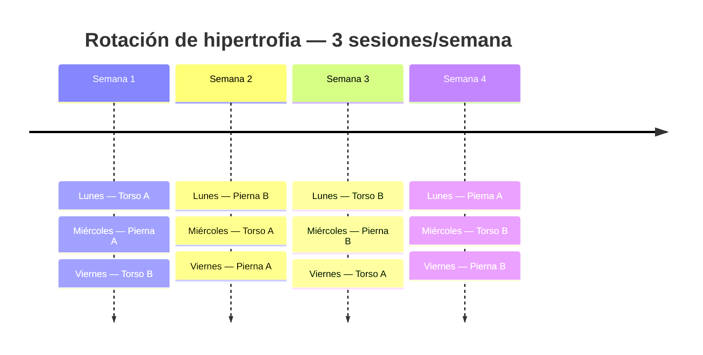

# Rutina de hipertrofia personalizada: diseño final basado en evidencia

## Resumen ejecutivo

Tras revisar la evidencia actual sobre **orden de ejercicios, volumen, descansos, proximidad al fallo, superseries, frecuencia, entrenamiento concurrente y selección de ejercicios para glúteos**, cambiaría ligeramente algunas decisiones que habíamos ido tomando en la conversación y dejaría una versión final más coherente con tus prioridades.

La conclusión más importante para la duda que tenías sobre **Torso A** es esta: **sí, tiene sentido colocar jalón y remo consecutivos**. La evidencia no muestra que el orden de ejercicios produzca diferencias claras en hipertrofia por sí mismo, pero sí muestra que los ejercicios colocados antes en una sesión tienden a mejorar más su rendimiento/fuerza. Por eso, cuando existe una prioridad concreta, una estrategia razonable es colocarla al principio. citeturn0search0turn7view0

En tu caso quiero dos identidades distintas:

> **Torso A = espalda primero → hombro lateral → pecho**  
> **Torso B = hombro lateral primero → dorsal/espalda → pecho**

Eso resuelve precisamente lo que te preocupaba. En Torso A **no intercalaría laterales entre jalón y remo**. Haría:

> **Jalón → Remo → Laterales → Press inclinado...**

Mientras que en Torso B sí daría a las elevaciones laterales el puesto número uno:

> **Laterales → Jalón → Press plano → High row...**

La prioridad de glúteos queda igualmente explícita. Pierna A será **cuádriceps + glúteo**, mientras que Pierna B será **glúteo dominante**. Mantendremos ejercicios estables: hack, prensa, hip thrust en máquina, curl femoral sentado, extensiones y máquinas. No necesitas ni búlgaras ni RDL para construir una buena rutina de hipertrofia de glúteos; tanto patrones de sentadilla como hip thrust han producido hipertrofia glútea en estudios longitudinales, y una revisión específica reciente respalda el uso de distintos patrones de extensión de cadera. citeturn5search17turn1search13

La versión que recomiendo comenzar es la **conservadora**, no la agresiva. Tienes 41 años, haces tres sesiones de hipertrofia por semana y además quieres mantener 2–3 CaCo. El entrenamiento concurrente no parece comprometer de forma significativa la hipertrofia ni la fuerza máxima en términos generales, pero sigue existiendo un coste de fatiga y el trabajo de resistencia puede interferir especialmente con cualidades explosivas si se junta demasiado con la fuerza. citeturn2view7

Tus sesiones quedarían aproximadamente en:

| Sesión | Duración normal |
|---|---:|
| **Torso A** | **55–63 min** |
| **Pierna A** | **60–68 min** |
| **Torso B** | **54–62 min** |
| **Pierna B** | **60–69 min** |

Estas estimaciones incluyen calentamiento específico razonable y transiciones normales, pero no esperas prolongadas por máquinas.

**Esta sería mi elección final para FORJA.**

## Base científica y decisiones de diseño

### Orden de los ejercicios

La revisión sistemática y metaanálisis específicamente dedicada al orden de los ejercicios encontró que la hipertrofia no cambia de forma clara al comenzar por ejercicios multiarticulares o monoarticulares; sin embargo, las ganancias de fuerza tienden a favorecer los ejercicios colocados antes. Por tanto, **no existe una obligación científica de poner press antes que laterales, ni de separar un jalón de un remo**. citeturn0search0

La actualización de ACSM de 2026 también destaca que la programación debe individualizarse y que la prioridad práctica debe ser un programa sostenible y alineado con los objetivos del individuo. citeturn7view0

Esto permite diseñar tus dos torso de forma deliberadamente asimétrica:

| Sesión | Prioridad de comienzo |
|---|---|
| **Torso A** | Espalda |
| **Torso B** | Deltoide lateral |
| **Pierna A** | Cuádriceps + glúteo |
| **Pierna B** | Glúteo |

En **Torso A**, jalón y remo van seguidos porque quiero que ambos reciban tu mejor rendimiento de la sesión. Es cierto que el jalón producirá algo de fatiga en dorsal, bíceps y agarre antes del remo, pero no existe una regla que obligue a separarlos; aceptamos esa pequeña pérdida potencial en el segundo ejercicio porque precisamente estamos dedicando el comienzo completo de Torso A a tu prioridad de espalda.

Después va el deltoide lateral. Así no cae al quinto o sexto ejercicio, pero tampoco interrumpe el bloque principal de espalda.

En Torso B hacemos lo contrario: las elevaciones laterales van **primeras**, de modo que el deltoide lateral recibe periódicamente un estímulo estando totalmente fresco. Estudios directos confirman que tanto elevaciones laterales con cable como con mancuerna pueden producir hipertrofia del deltoide lateral, por lo que puedes elegir la variante estable que mejor te permita progresar. citeturn3search7

### Volumen y frecuencia

La evidencia más reciente sigue encontrando una relación dosis-respuesta positiva entre volumen y crecimiento muscular, pero con **rendimientos decrecientes** a medida que aumenta el volumen. La metarregresión publicada en 2026 además encuentra que contar de forma fraccionada las series indirectas describe mejor la dosis que considerar todos los ejercicios multiarticulares como una serie completa para cada músculo implicado. citeturn2view3

ACSM resume actualmente un objetivo aproximado de **~10 series semanales por grupo muscular** cuando se quiere maximizar hipertrofia, pero esto debe entenderse como una referencia, no como una frontera mágica por debajo de la cual no se crece. citeturn7view0

Esto es especialmente importante contigo. Tu rutina no es cuatro días cada semana, sino:

> **Torso A → Pierna A → Torso B → Pierna B**

entrenando únicamente **tres veces por semana**.

Por tanto, una vuelta completa tarda aproximadamente:

> 4 ÷ 3 = **1,33 semanas**

y cada sesión concreta aparece de media:

> **0,75 veces por semana**.

Los grupos de torso y pierna reciben dos exposiciones por vuelta, aproximadamente:

> **1,5 estímulos semanales de media**.

No me preocupa que no sean exactamente dos exposiciones cada semana de calendario. Cuando el volumen se iguala, aumentar la frecuencia por sí misma no parece producir diferencias grandes o consistentes en hipertrofia. citeturn1search35turn2view3

### RIR y rango de repeticiones

La hipertrofia puede conseguirse utilizando un rango bastante amplio de cargas y repeticiones si las series tienen suficiente esfuerzo; las cargas más elevadas sí presentan ventaja específica para el desarrollo de fuerza máxima. citeturn3search0turn3search4

Por eso no veo ninguna necesidad de hacer todo a 6–8 repeticiones. Para ti utilizaría principalmente:

> **8–12** en compuestos estables  
> **10–15** en máquinas/accesorios  
> **12–20** en laterales, posteriores y sóleo  
> **15–25** en tibial y abductora.

Tampoco necesitas llegar al fallo muscular en todas las series. La evidencia más reciente sugiere que entrenar más cerca del fallo puede favorecer la hipertrofia, pero una comparación directa en personas entrenadas encontró hipertrofia similar entrenando al fallo o dejando aproximadamente 1–2 RIR. citeturn6search0turn6search1

Por ello utilizaría:

> **Compuestos principales: 2 RIR**  
> **Máquinas secundarias: 1–2 RIR**  
> **Aislamientos: 1–2 RIR**  
> **Última serie de algún aislamiento: opcionalmente 0–1 RIR**

No quiero fallo habitual en hack, prensa, hip thrust, presses, jalones o remos.

### Descansos

Una revisión sistemática y metaanálisis de 2024 encontró una pequeña ventaja hipertrófica al descansar **más de 60 segundos**, probablemente en parte por poder mantener mejor el trabajo de las series siguientes. citeturn0search16

Además, en hombres entrenados, un ensayo que comparó descansos más largos frente a cortos encontró ventajas para fuerza e hipertrofia utilizando descansos largos. citeturn0search19

Por eso descartaría la idea de descansar 60–90 segundos en absolutamente todo. Tus descansos quedarán autoregulados según la exigencia:

> **Hack: 180 s**  
> **Prensa/presses/hip thrust: 120–150 s**  
> **Jalones y remos: 120 s**  
> **Curl femoral: 120 s**  
> **Aislamientos: 60–90 s**

FORJA debe mostrar un intervalo recomendado y un botón **`+30 s`**, porque el cronómetro debe ayudarte, no obligarte a empezar una serie antes de estar preparado.

## Estructura semanal y versiones comparadas

Como entrenas tres días pero tienes cuatro sesiones diferentes, **no debes reiniciar la rutina cada lunes**. FORJA tiene que guardar cuál es la siguiente sesión de la secuencia.

Un ejemplo con lunes-miércoles-viernes sería:



Después de la semana cuatro vuelve a repetirse exactamente el patrón.

### Conservadora frente a agresiva

No utilizaría "agresiva" como sinónimo de llevar más series al fallo. La diferencia sería simplemente **algo más de volumen para tus prioridades**, conservando RIR y técnica.

| Variable | **Conservadora — recomendada** | **Agresiva** |
|---|---:|---:|
| Deltoide lateral directo | ~9 series/sem | ~10,5 series/sem |
| Dorsal/espalda | ~10,5 series/sem | ~12 series/sem |
| Glúteo máx. equivalente | ~10 series/sem | ~11,5–12 series/sem |
| RIR compuestos | 2 | 1–2 |
| RIR aislamientos | 1–2 | 1–2 |
| Torso | ~54–63 min | ~60–68 min |
| Pierna | ~60–69 min | ~64–73 min |
| Adecuada con 2–3 CaCo | **Sí** | Solo si recuperación muy buena |
| Mi elección inicial | **Sí** | No |

La versión agresiva no requiere reconstruir la rutina. Consistiría en añadir únicamente:

| Sesión | Cambio |
|---|---|
| Torso A | +1 serie al jalón |
| Torso B | +1 serie al high row |
| Pierna A | +1 hip thrust y +1 lateral |
| Pierna B | +1 hip thrust y +1 lateral |

Empezaría **al menos 6–8 semanas con la conservadora**. Solo aumentaría volumen si progresas bien, no tienes dolor, el CaCo no está empeorando y tus últimas series no muestran deterioro persistente.

La lógica encaja con la evidencia actual: más volumen puede aportar más crecimiento, pero los retornos disminuyen y no compensa simplemente acumular series si empeora su calidad o tu recuperación. citeturn2view3turn7view0

## Rutina final ejercicio por ejercicio

Esta es la versión que considero **definitiva para empezar**.

### Torso A — espalda prioritaria

La decisión más importante respecto a nuestras versiones anteriores es que **jalón y remo quedan juntos**. Las laterales pasan al puesto tres.

| Día | Orden | Ejercicio | Series | Reps | Descanso | Superserie sí/no | Nota |
|---|---:|---|---:|---:|---|---|---|
| Torso A | 1 | **Jalón al pecho agarre medio** | 3 | 8–12 | **120 s** [105–150] | No | **RIR 2. Prioridad dorsal.** |
| Torso A | 2 | **Remo con pecho apoyado** | 3 | 8–12 | **120 s** [105–150] | No | **RIR 2.** Sin fatiga lumbar innecesaria. |
| Torso A | 3 | ⭐ **Elevación lateral máquina/cable** | 4 | 12–20 | **75 s** [60–90] | No | **RIR 1–2. Prioridad.** No superseriar aquí. |
| Torso A | 4 | Press inclinado máquina | 3 | 8–12 | **150 s** [120–180] | No | RIR 2. |
| Torso A | 5 | Reverse pec deck | 2 | 12–20 | **75 s** [60–90] | No | RIR 1–2. Deltoide posterior. |
| Torso A | 6 | Press hombro máquina | 2 | 8–12 | **120 s** [105–150] | No | RIR 2. No perseguir fallo. |
| Torso A | 7 | Curl bíceps máquina/polea | 2 | 10–15 | **15 s → pareja** | Sí | RIR 1–2. **SS-A.** |
| Torso A | 8 | Extensión tríceps polea | 2 | 10–15 | **90 s** [75–105] tras pareja | Sí | RIR 1–2. **SS-A.** |

**Por qué este orden:** Torso A dedica sus dos primeros puestos a espalda. Luego el deltoide lateral sigue apareciendo suficientemente pronto para ser una prioridad real. Press inclinado y press de hombro quedan después porque pecho y deltoide anterior no son tus principales objetivos.

No veo razón para alternar jalón con press únicamente por una regla estética de "pull-push-pull". La evidencia sobre orden permite priorizar lo que más te importa al comienzo. citeturn0search0

### Torso B — deltoide lateral prioritario

| Día | Orden | Ejercicio | Series | Reps | Descanso | Superserie sí/no | Nota |
|---|---:|---|---:|---:|---|---|---|
| Torso B | 1 | ⭐ **Elevación lateral máquina/cable** | 4 | 12–20 | **75 s** [60–90] | No | **RIR 1–2. Máxima prioridad.** |
| Torso B | 2 | ⭐ **Jalón neutro/semineutro** | 3 | 8–12 | **120 s** [105–150] | No | RIR 2. Dorsal. |
| Torso B | 3 | Press plano máquina | 3 | 8–12 | **150 s** [120–180] | No | RIR 2. |
| Torso B | 4 | ⭐ **High row / remo pecho apoyado** | 3 | 8–12 | **120 s** [105–150] | No | RIR 2. Espalda alta + dorsal. |
| Torso B | 5 | Reverse pec deck | 2 | 12–20 | **15 s → pareja** | Sí | RIR 1–2. **SS-A.** |
| Torso B | 6 | Pec deck | 2 | 10–15 | **90 s** [75–105] tras pareja | Sí | RIR 1–2. **SS-A.** |
| Torso B | 7 | Curl bíceps máquina/polea | 2 | 10–15 | **15 s → pareja** | Sí | RIR 1–2. **SS-B.** |
| Torso B | 8 | Tríceps overhead con cable | 2 | 10–15 | **90 s** [75–105] tras pareja | Sí | RIR 1–2. **SS-B.** |

Aquí no pondría press plano primero. Para una persona que priorizase pecho sería lógico; **para ti no lo es**. Las laterales tienen una sesión en la que reciben el primer puesto absoluto.

El reverse pec deck y pec deck pueden emparejarse porque son accesorios con acciones opuestas y no necesitamos rendimiento máximo de ninguno. El metaanálisis de superseries de 2025 encontró que las superseries pueden reducir el tiempo manteniendo de forma general el volumen y las adaptaciones, mientras que las configuraciones agonista-antagonista mantienen mejor el rendimiento que emparejar ejercicios biomecánicamente muy similares. citeturn2view5

### Pierna A — cuádriceps + glúteo

| Día | Orden | Ejercicio | Series | Reps | Descanso | Superserie sí/no | Nota |
|---|---:|---|---:|---:|---|---|---|
| Pierna A | 1 | **Hack squat** | 3 | 8–12 | **180 s** [150–210] | No | RIR 2. Nunca superseriar. |
| Pierna A | 2 | ⭐ **Hip thrust máquina / glute drive** | 3 | 8–12 | **150 s** [120–180] | No | **RIR 1–2. Glúteo prioritario.** |
| Pierna A | 3 | Prensa | 2 | 10–15 | **150 s** [120–180] | No | RIR 2. |
| Pierna A | 4 | **Curl femoral sentado** | 3 | 10–15 | **120 s** [90–150] | No | RIR 1–2. |
| Pierna A | 5 | Extensión cuádriceps | 2 | 10–15 | **15 s → pareja** | Sí | RIR 1–2. **SS-A.** |
| Pierna A | 6 | ⭐ Elevaciones laterales | 2 | 12–20 | **90 s** [75–105] tras pareja | Sí | RIR 1–2. **SS-A.** |
| Pierna A | 7 | Gemelo de pie | 2 | 10–15 | **15 s → pareja** | Sí | RIR 1–2. Rodilla casi extendida. **SS-B.** |
| Pierna A | 8 | ⭐ Pullover máquina/polea | 2 | 10–15 | **90 s** [75–105] tras pareja | Sí | RIR 1–2. **SS-B.** Microdosis dorsal. |
| Pierna A | 9 | Sóleo sentado | 2 | 12–20 | **10–15 s → pareja** | Sí | RIR 1–2. Rodilla flexionada. **SS-C.** |
| Pierna A | 10 | Tibial anterior | 2 | 15–25 | **75 s** [60–90] tras pareja | Sí | RIR 1–2. **SS-C.** |

He elegido **curl femoral sentado** como primera opción. En un ensayo longitudinal que comparó directamente curl sentado frente a tumbado, el sentado produjo mayor hipertrofia de varios músculos isquiotibiales, probablemente relacionado con entrenarlos a una mayor longitud muscular. citeturn5search0

No significa que el tumbado sea malo; simplemente el sentado será tu opción A cuando esté disponible.

### Pierna B — glúteo prioritario

| Día | Orden | Ejercicio | Series | Reps | Descanso | Superserie sí/no | Nota |
|---|---:|---|---:|---:|---|---|---|
| Pierna B | 1 | ⭐ **Hip thrust máquina / glute drive** | 3 | 8–12 | **150 s** [120–180] | No | **RIR 1–2. Prioridad absoluta glúteo.** |
| Pierna B | 2 | ⭐ **Prensa con sesgo glúteo** | 3 | 10–15 | **150 s** [120–180] | No | RIR 2. Pies algo más altos, sin exagerar. |
| Pierna B | 3 | ⭐ **Extensión 45° sesgo glúteo** | 2 | 10–15 | **90 s** [75–120] | No | RIR 1–2. Extensión de cadera; no hiperextender lumbar. |
| Pierna B | 4 | Curl femoral sentado | 3 | 10–15 | **120 s** [90–150] | No | RIR 1–2. |
| Pierna B | 5 | Máquina abductora | 2 | 15–25 | **15 s → pareja** | Sí | RIR 1–2. **SS-A.** Glúteo medio. |
| Pierna B | 6 | Gemelo de pie | 2 | 10–15 | **90 s** [75–105] tras pareja | Sí | RIR 1–2. **SS-A.** |
| Pierna B | 7 | Extensión cuádriceps | 2 | 10–15 | **15 s → pareja** | Sí | RIR 1–2. **SS-B.** |
| Pierna B | 8 | ⭐ Elevaciones laterales | 2 | 12–20 | **90 s** [75–105] tras pareja | Sí | RIR 1–2. **SS-B.** |
| Pierna B | 9 | Sóleo sentado | 2 | 12–20 | **10–15 s → pareja** | Sí | RIR 1–2. **SS-C.** |
| Pierna B | 10 | Tibial anterior | 2 | 15–25 | **75 s** [60–90] tras pareja | Sí | RIR 1–2. **SS-C.** |

La evidencia longitudinal disponible muestra que hip thrust y variantes de sentadilla pueden producir crecimiento importante del glúteo; en una comparación directa de nueve semanas, ambos produjeron hipertrofia glútea similar, aunque la sentadilla generó más crecimiento del muslo. citeturn5search17

Eso encaja muy bien con tu objetivo. No buscamos encontrar un supuesto "único mejor ejercicio de glúteo": combinamos un ejercicio donde la extensión de cadera es protagonista —hip thrust— con patrones de prensa/sentadilla y otro de extensión de cadera. La revisión sistemática específica sobre hipertrofia del glúteo máximo publicada en 2025 respalda que diversos ejercicios de extensión de cadera pueden ser efectivos. citeturn1search13

En la prensa de Pierna B, "sesgo glúteo" **no significa colocar los pies en la parte más alta posible**. Una posición algo más alta puede modificar el reparto del trabajo hacia la cadera en estudios biomecánicos, pero la evidencia basada únicamente en activación muscular no permite asegurar que una colocación concreta produzca automáticamente mayor hipertrofia. citeturn5search12

Quiero:

> pies algo más altos que en Pierna A → profundidad cómoda → pelvis estable → sin despegar lumbar/sacro → progresar cargas y reps.

## Volumen, superseries y duración

### Volumen medio semanal real

Como cada sesión ocurre **0,75 veces por semana**, no debemos sumar el volumen A+B y llamarlo directamente "volumen semanal". Multiplicamos por 0,75.

Para grupos que trabajan indirectamente en compuestos utilizo además una aproximación fraccionada, porque la metarregresión más reciente encontró mejor ajuste cuando las series indirectas no se contabilizaban automáticamente como una serie completa. citeturn2view3

| Grupo | Series por vuelta A+B | Media semanal aproximada | Prioridad |
|---|---:|---:|---|
| **Deltoide lateral** | 12 directas | **9 directas**; ~9,5–10 equivalentes | ⭐ Muy alta |
| **Dorsal/espalda** | 14 principales | **~10,5** | ⭐ Muy alta |
| Deltoide posterior | 4 directas + remos | **3 directas + trabajo indirecto** | Alta |
| Pecho | 8 directas | **6** | Secundaria |
| Bíceps | 4 directas + tirones | **3 directas; ~7–8 equivalentes** | Secundaria |
| Tríceps | 4 directas + presses | **3 directas; ~6 equivalentes** | Secundaria |
| **Glúteo máximo** | HT + hack/prensas + 45° | **~10 series equivalentes** | ⭐ Muy alta |
| Glúteo medio | 2 abductora + compuestos | **1,5 directas + indirectas** | Complementaria |
| Cuádriceps | 12 series principales | **~9** | Moderada |
| Isquios | 6 curl + 45° indirecto | **~5–6 equivalentes** | Moderada |
| Gastrocnemio/"gemelo" | 4 | **3** | Complementaria |
| Sóleo | 4 | **3** | Complementaria |
| Tibial | 4 | **3** | Complementaria |

Esto muestra algo importante: **no estamos intentando maximizar simultáneamente todos los músculos**.

Si intentásemos conseguir 10–15 series directas semanales para pecho, brazos, cuádriceps, isquios, gemelo, sóleo, glúteo, dorsal, hombro lateral y posterior, tus entrenamientos volverían a convertirse en las sesiones monstruosas de 80–100 minutos que precisamente queríamos evitar.

La programación moderna reconoce la relación entre mayor volumen e hipertrofia pero también sus rendimientos decrecientes. citeturn2view3turn7view0

Por tanto estamos gastando nuestro "presupuesto de recuperación" principalmente en:

> **deltoide lateral + dorsal/espalda + glúteos**

y dejando el resto en volúmenes suficientes para progresar más lentamente o mantener/ganar dependiendo de tu respuesta individual.

### Qué NO superseriar

Aquí sería estricto.

**No superseriaría entre sí ni con otro ejercicio demandante:**

| Ejercicio | Motivo práctico |
|---|---|
| Hack squat | Gran fatiga sistémica y local |
| Hip thrust | Prioridad glúteo y carga alta |
| Prensa | Queremos mantener reps y técnica |
| Jalón principal | Prioridad de espalda |
| Remo principal | Prioridad de espalda |
| Press inclinado/plano | Ejercicios compuestos |
| Press de hombro | Compuesto |
| Curl femoral sentado | Quiero buena calidad de serie |
| Laterales al comienzo de Torso B | Es tu prioridad del día |
| Laterales de Torso A | Se mantienen solas para maximizar su calidad |

La razón no es que las superseries sean "malas". El metaanálisis más reciente muestra que pueden conseguir adaptaciones crónicas similares ahorrando tiempo, pero también elevan la percepción de esfuerzo y las superseries que utilizan movimientos biomecánicamente similares pueden reducir el volumen de trabajo. citeturn2view5

Por eso nosotros las empleamos **quirúrgicamente**.

### Cómo ejecutar cada superserie

No quiero:

> ejercicio A → descansar 60 s → ejercicio B → descansar 60 s.

Eso apenas ahorra tiempo.

Quiero:

> **Ejercicio A → 10–20 s de transición → Ejercicio B → descanso completo → repetir.**

Por ejemplo Pierna A:

**SS-A**
> Extensión de cuádriceps → 15 s → Laterales → **90 s** → repetir.

**SS-B**
> Gemelo de pie → 15 s → Pullover → **90 s** → repetir.

**SS-C**
> Sóleo → 10–15 s → Tibial → **75 s** → repetir.

En Torso A:

> Curl → 15 s → Tríceps → **90 s** → repetir.

En Torso B:

> Reverse pec deck → 15 s → Pec deck → **90 s**.

y:

> Curl → 15 s → Tríceps → **90 s**.

Son emparejamientos con poca competencia directa entre músculos o acciones antagonistas. Esto aprovecha justamente el tipo de superserie que mejor conserva el trabajo realizado según la síntesis de 2025. citeturn2view5

### Duración calculada

Con los descansos establecidos:

| Sesión | Series de trabajo | Superseries | Tiempo objetivo |
|---|---:|---:|---:|
| Torso A | 21 | 1 | **55–63 min** |
| Torso B | 21 | 2 | **54–62 min** |
| Pierna A | 23 | 3 | **60–68 min** |
| Pierna B | 23 | 3 | **60–69 min** |

Esto supone aproximadamente 7–10 minutos de calentamiento/ramp-up, una velocidad normal para cambiar de ejercicio y que no esperas cinco minutos a que quede libre una máquina.

Si pulsas `+30 s` unas cuantas veces en hack, prensa o hip thrust, un Pierna puede acercarse a:

> **~70–72 min**

ocasionalmente.

Eso está bien.

No recortaría descansos importantes simplemente para que FORJA muestre "59:59".

## Progresión, RIR y convivencia con CaCo

### Doble progresión

FORJA debería implementar la progresión de la siguiente manera.

Para un ejercicio programado como:

> **3 × 8–12 @ 2 RIR**

puedes comenzar, por ejemplo:

> 10 / 9 / 8

con el mismo peso.

Mantienes el peso en sesiones posteriores:

> 11 / 10 / 9  
> 12 / 11 / 10  
> 12 / 12 / 11  
> **12 / 12 / 12**

Cuando consigues el techo del rango en todas las series **manteniendo el RIR objetivo y técnica correcta**, subes la carga el siguiente día.

FORJA debe usar:

> **el incremento mínimo disponible en la máquina**

y no asumir incrementos fijos en kg, porque una máquina puede saltar 2,5 kg y otra 5 o 10 kg.

Al aumentar el peso es perfectamente normal volver, por ejemplo, a:

> 9 / 9 / 8.

### Cómo registrar el RIR

En los compuestos:

> Primera serie: normalmente **2 RIR**  
> Última serie: puede acabar en **1–2 RIR**

En aislamientos:

> **1–2 RIR**

y de forma opcional:

> último set de laterales, curl, tríceps, extensión o abductora → **0–1 RIR**

si la técnica sigue siendo buena.

No convertiría el fallo en requisito. La investigación sobre proximidad al fallo apoya entrenar suficientemente cerca de él para hipertrofia, pero no demuestra que cada serie tenga que acabar necesariamente en fallo muscular. citeturn6search0turn6search1turn6search2

### Lógica del botón `+30 s`

FORJA debe arrancar el temporizador automáticamente al finalizar una serie.

Ejemplo:

> Jalón → `02:00`

y presentar:

> **+30 s**

Cuando se pulsa:

> `02:30`

No debe marcar la serie como "fallida", romper el entrenamiento ni alterar las siguientes series.

Yo utilizaría `+30 s` cuando ocurra cualquiera de estas situaciones:

> todavía respiras muy fuerte;  
> el músculo principal sigue claramente fatigado;  
> la serie anterior fue excepcionalmente dura;  
> la siguiente serie probablemente perdería varias repeticiones únicamente por falta de recuperación.

En hack, prensa e hip thrust prefiero **30 segundos más y una gran serie** que ahorrar medio minuto y producir una serie mediocre.

### Integración con CaCo

Una actualización sistemática que incluyó 43 estudios no encontró un deterioro significativo de hipertrofia o fuerza máxima al combinar fuerza y resistencia frente a fuerza aislada, aunque sí observó una reducción de las adaptaciones de fuerza explosiva; esta fue más evidente cuando ambos tipos de entrenamiento se hacían en la misma sesión que cuando se separaban al menos tres horas. citeturn2view7

Por tanto, con tus **2–3 CaCo semanales** no veo necesario modificar radicalmente la rutina.

La regla práctica que utilizaría es:

> **evitar el CaCo más exigente inmediatamente antes de Pierna A o Pierna B.**

Cuando coincidan fuerza y CaCo el mismo día, separarlos varias horas es preferible desde el punto de vista de gestión de fatiga; la evidencia disponible indica específicamente menor interferencia sobre fuerza explosiva cuando se separan al menos tres horas. citeturn2view7

Y dado que el glúteo es una prioridad tuya, no usaría la carrera como excusa para reducir automáticamente hip thrust/prensa. Primero observamos cómo recuperas.

## Alternativas e importación a FORJA/Vibe

### Sustituciones si una máquina está ocupada

Las alternativas conservan tu requisito fundamental: **estabilidad**. No te voy a mandar a hacer búlgaras, RDL o variantes técnicamente complejas solo porque haya una máquina ocupada.

| Ejercicio principal | Alternativa preferida | Segunda alternativa |
|---|---|---|
| Jalón | Jalón plate-loaded | Dominada asistida |
| Remo pecho apoyado | Remo máquina sentado | Remo cable con apoyo |
| Elevación lateral máquina | Cable lateral | Mancuernas |
| Press inclinado máquina | Smith inclinado | Press convergente |
| Press plano máquina | Smith plano | Press convergente |
| Reverse pec deck | Reverse fly en cables | Máquina posterior |
| Press hombro máquina | Smith sentado | Otra máquina convergente |
| Hack squat | Pendulum squat | Prensa |
| Hip thrust máquina | Glute drive | Hip thrust Smith |
| Prensa | Otra prensa estable | Hack/pendulum |
| Curl femoral sentado | Curl femoral tumbado | Curl máquina unilateral |
| Extensión cuádriceps | Otra máquina de extensión | Mantener y esperar si no hay equivalente |
| Extensión 45° glúteo | Máquina de extensión de cadera | Glute drive ligero |
| Abductora | Abducción en cable con apoyo | Banda solo como emergencia |
| Gemelo de pie | Calf press en prensa | Gemelo Smith |
| Sóleo sentado | Seated calf machine | Calf con rodilla flexionada |
| Tibial | Tib bar | Dorsiflexión en cable/banda |
| Pullover | Straight-arm pulldown | Máquina pullover |

Para laterales, no hay necesidad de obsesionarnos con cable frente a mancuernas: un ensayo reciente en personas entrenadas encontró aumentos similares del grosor del deltoide lateral con ambas variantes. citeturn3search7

### Configuración que debe recibir Vibe Coding

El módulo no debe tratar las sesiones como cuatro días obligatorios dentro de una misma semana. Debe utilizar **secuencia persistente**.

```json
{
  "program_name": "Hipertrofia personalizada - Rotacion 4 sesiones",
  "language": "es-ES",
  "experience_level": "intermedio",
  "sessions_per_week": 3,
  "schedule_mode": "rolling_sequence",
  "sequence": [
    "Torso A",
    "Pierna A",
    "Torso B",
    "Pierna B"
  ],
  "reset_sequence_on_monday": false,
  "priorities": [
    "deltoide lateral",
    "dorsal y espalda en V",
    "gluteos"
  ],
  "excluded_exercises": [
    "sentadilla bulgara",
    "peso muerto rumano"
  ],
  "core_in_gym": false,
  "core_at_home_sessions_per_week": 2,
  "progression": {
    "type": "double_progression",
    "increase_load_when_all_sets_hit_top_of_rep_range_at_target_rir": true,
    "load_increment": "smallest_available_increment"
  },
  "timer": {
    "automatic_after_set": true,
    "show_recommended_range": true,
    "allow_plus_30_seconds": true
  },
  "supersets": {
    "transition_seconds_default": 15,
    "countdown_starts_after_second_exercise": true
  }
}
```

### Instrucción lista para pegar a Vibe Coding

```text
Reemplaza SOLO el módulo actual de rutina de hipertrofia de FORJA por esta
programación. No modifiques dieta, peso, CaCo, postura, core doméstico ni otros
módulos existentes.

La rutina NO funciona por días fijos de la semana.

Debe funcionar como una secuencia persistente:

Torso A -> Pierna A -> Torso B -> Pierna B -> Torso A...

El usuario entrena 3 veces por semana. Si termina Torso B el viernes, la siguiente
sesión debe ser Pierna B independientemente de que sea una nueva semana.

Cada ejercicio debe guardar:
- orden
- series
- rango de repeticiones
- RIR objetivo
- peso usado
- repeticiones reales de cada serie
- descanso por defecto
- rango recomendado de descanso
- pertenencia a superserie
- historial
- notas técnicas

TEMPORIZADOR:
Al terminar cada serie iniciar automáticamente el descanso correspondiente.
Mostrar siempre botón "+30 s".
Pulsar +30 s amplía únicamente el descanso actual y NO modifica la programación.

SUPERSETS:
Cuando dos ejercicios estén marcados con el mismo identificador de superserie:
Ejercicio A -> transición aproximada de 10-20 s -> ejercicio B -> arrancar
temporizador de descanso -> siguiente ronda.

No iniciar un descanso completo entre A y B.

DOBLE PROGRESIÓN:
Mantener el peso mientras no se alcance el máximo del rango de repeticiones en
todas las series con el RIR objetivo.
Cuando se alcance el máximo en todas las series, recomendar el incremento mínimo
disponible de la máquina para la siguiente exposición.

No exigir entrenamiento al fallo.
```

### Fuente de verdad para el importador

La tabla anterior de la rutina debe tratarse como **source of truth**. Para evitar que Vibe Coding interprete los rangos de descanso como valores aleatorios, la lógica debe ser:

> primer número = **temporizador por defecto**  
> intervalo entre corchetes = **rango aceptable/autoregulado**.

Por ejemplo:

> `Hack squat: 180 s [150–210]`

significa:

```text
default_rest_seconds = 180
recommended_min_seconds = 150
recommended_max_seconds = 210
allow_plus_30 = true
```

Y:

> `Elevación lateral: 75 s [60–90]`

significa:

```text
default_rest_seconds = 75
recommended_min_seconds = 60
recommended_max_seconds = 90
allow_plus_30 = true
```

En superserie:

```text
A -> transition_seconds = 15
B -> pair_rest_seconds = 90
```

No debe sumar automáticamente 90 segundos después de A.

**La versión que implementaría ahora mismo en FORJA es la conservadora.** Es suficientemente alta en volumen para que deltoide lateral, espalda y glúteos sean prioridades reales, mantiene los ejercicios más productivos antes de la fatiga, deja jalón y remo juntos en Torso A como planteabas, permite que las laterales sean el primer ejercicio en Torso B, mantiene Pierna A/B dentro de aproximadamente una hora y reserva la versión agresiva como una progresión futura en lugar de empezar gastando todo tu margen de recuperación desde el primer día. La evidencia actual favorece precisamente esa combinación de individualización, suficiente volumen, esfuerzo cercano al fallo y sostenibilidad frente a perseguir una estructura teóricamente “perfecta” pero excesivamente compleja. citeturn7view0turn2view3